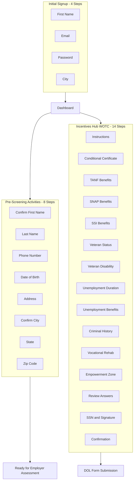

# Rezme User Data Collection Strategy

## Executive Summary

This document outlines the progressive data collection strategy implemented in Rezme. The key points are:

- **No data fields were eliminated** from the platform
- **Data collection was redistributed** across the user journey
- **Goal:** Reduce friction at signup while ensuring complete data collection when contextually appropriate

By asking users for information only when it's relevant to their current task, we improve completion rates, reduce drop-off, and create a more intuitive user experience.

---

## Data Collection Flow Overview

The user journey is divided into three main data collection points:

---

## Data Fields by Collection Point

### Section A: Initial Signup

**Location:** `src/app/auth/user/signup/page.tsx`

| Step | Field | Input Type | Purpose |
|------|-------|------------|---------|
| 1 | First Name | Text | Personalization, dashboard greeting |
| 2 | Email | Email | Account authentication, communication |
| 3 | Password | Password | Account security |
| 4 | City | Text | Local resources and opportunities |

**Design Notes:**
- Each field is presented on its own screen
- Users can navigate back to edit previous answers
- Minimal data required to create a functional account

---

### Section B: Pre-Screening Activities

**Location:** `src/app/restorative-record/page.tsx` (Pre-Screening Modal)

**Trigger:** User clicks "Start Assessment" in the Pre-Screening Activities tab

| Step | Field | Input Type | Purpose |
|------|-------|------------|---------|
| 1 | First Name | Confirm/Edit | Verification of signup data |
| 2 | Last Name | Text | Complete legal name for employment |
| 3 | Phone Number | Phone | Employer contact method |
| 4 | Date of Birth | Date | Age verification, eligibility |
| 5 | Address | Text | Background check, employment records |
| 6 | City | Confirm/Edit | Verification of signup data |
| 7 | State | Text | State-specific programs and requirements |
| 8 | Zip Code | Text | Location verification, zone eligibility |

**Design Notes:**
- Pre-populates First Name and City from signup data
- Allows users to confirm or edit pre-populated fields
- Collected when user is actively pursuing employment opportunities

---

### Section C: Incentives Hub - WOTC Survey

**Location:** `src/app/restorative-record/page.tsx` (WOTC Survey Modal)

**Trigger:** User clicks "Edit WOTC Survey" in the Incentives Hub tab

#### Instructions Screen (Step 0)
Before questions begin, users see clear instructions:
- Survey helps employers check tax credit eligibility
- No right or wrong answers
- Answers do not affect job eligibility
- "Not sure" is an acceptable answer

#### Survey Questions (Steps 1-11)

| Step | Question | Options | Purpose |
|------|----------|---------|---------|
| 1 | Conditional Certificate received before job offer? | Yes / No | WOTC pre-certification check |
| 2 | Received TANF in past 18 months? | Yes / No / Not sure | Tax credit eligibility |
| 3 | Received SNAP in past 6 months? | Yes / No / Not sure | Tax credit eligibility |
| 4 | Received SSI in past 60 days? | Yes / No / Not sure | Tax credit eligibility |
| 5 | Veteran of U.S. Armed Forces? | Yes / No | Tax credit eligibility |
| 6 | Service-connected disability? (if veteran) | Yes / No / Not sure | Tax credit eligibility |
| 7 | Unemployed for 27+ weeks? | Yes / No / Not sure | Tax credit eligibility |
| 8 | Received unemployment compensation? | Yes / No / Not sure | Tax credit eligibility |
| 9 | Felony conviction, released in past year? | Yes / No / Not sure | Tax credit eligibility |
| 10 | Participated in vocational rehabilitation? | Yes / No / Not sure | Tax credit eligibility |
| 11 | Live in Empowerment Zone or Rural Renewal County? | Yes / No / Not sure | Tax credit eligibility |

#### Review and Submission (Steps 12-14)

| Step | Screen | Purpose |
|------|--------|---------|
| 12 | Review Answers | Display all answers with edit capability |
| 13 | SSN and Electronic Signature | Collect sensitive data for DOL submission |
| 14 | Confirmation | Confirm successful submission |

**Design Notes:**
- Each question includes expandable "Not sure what this means?" help content
- Help content provides:
  - Clear explanation of the question
  - Real-world examples
  - Documentation the user would have if they qualify
- Question 9 (Criminal History) emphasizes this is NOT disqualifying and explains employer tax benefits
- SSN is collected only at final step with security messaging
- Electronic signature certifies accuracy under penalty of perjury

---

## UX Design Principles Applied

### 1. One Question Per Screen
Inspired by CashApp's signup flow, each piece of information is requested on its own dedicated screen. This:
- Reduces cognitive load
- Improves focus
- Creates a sense of progress
- Allows for contextual messaging per field

### 2. Progressive Disclosure
Information is requested only when contextually appropriate:
- Basic info at signup → Gets user into the platform
- Detailed info at pre-screening → Required for employer assessments
- Sensitive info at incentives → Required for government forms

### 3. Contextual Help Content
For complex questions (especially WOTC survey), expandable help sections explain:
- What the question means in plain language
- Examples the user can relate to
- What documentation they would have if they qualify

### 4. Review and Edit Capability
Before final submission of sensitive data:
- Users see a summary of all their answers
- Each answer has an "Edit" button
- Editing returns user to the review screen after updating

### 5. Positive Framing
For potentially sensitive questions (criminal history):
- Emphasize that the answer is NOT disqualifying
- Explain the benefit to the user (employers get tax credits for hiring them)
- Remove stigma by focusing on the opportunity

---

## Rationale for Each Collection Point

### Why Collect at Signup
| Reason | Explanation |
|--------|-------------|
| Minimum viable data | Only what's needed to create an account |
| Fast onboarding | Gets user into the platform quickly |
| Immediate personalization | Dashboard can greet user by name |
| Local relevance | City enables location-based resources |

### Why Collect at Pre-Screening
| Reason | Explanation |
|--------|-------------|
| Contextual relevance | User is actively preparing for employment |
| Employer requirements | This data is needed for job applications |
| Trust established | User has explored the platform and understands value |
| Higher completion | User is motivated to complete the assessment |

### Why Collect at Incentives Hub
| Reason | Explanation |
|--------|-------------|
| Sensitive data protection | SSN only requested when absolutely necessary |
| Clear purpose | User understands data is for tax credit forms |
| Optional flow | Only users pursuing incentives need to complete |
| Government compliance | Follows DOL WOTC form requirements |

---

## Technical Implementation

### Files Modified

| File | Changes |
|------|---------|
| `src/app/auth/user/signup/page.tsx` | Multi-step signup flow (4 steps) |
| `src/app/restorative-record/page.tsx` | Pre-Screening Modal (8 steps) |
| `src/app/restorative-record/page.tsx` | WOTC Survey Modal (14 steps) |

### State Management

**Signup Flow:**
- `currentStep` - Tracks which step user is on (1-4)
- Individual state for each field (firstName, email, password, city)

**Pre-Screening Flow:**
- `preScreeningStep` - Tracks current step (1-8)
- `preScreeningData` - Object containing all pre-screening fields

**WOTC Survey Flow:**
- `wotcStep` - Tracks current step (0-14)
- `wotcAnswers` - Object containing all survey responses
- `wotcSSN` - Separate state for sensitive SSN data
- `wotcSignature` - Electronic signature for legal certification
- `wotcEditingQuestion` - Tracks if user is editing from review screen
- `wotcInfoExpanded` - Tracks which help section is expanded

---

## Data Persistence

| Collection Point | Storage | Timing |
|------------------|---------|--------|
| Signup | Supabase `user_profiles` | On account creation |
| Pre-Screening | Supabase `user_profiles` | On assessment completion |
| WOTC Survey | Supabase (TBD table) | On form submission |

---

## Future Considerations

1. **Phone verification** - Add SMS verification for phone numbers
2. **Address autocomplete** - Integrate Google Places API for address entry
3. **Empowerment Zone lookup** - Auto-detect based on zip code
4. **WOTC form generation** - Generate actual IRS Form 8850 and DOL ETA Form 9061
5. **State-specific routing** - Submit to appropriate state workforce agency

---

## Appendix: Complete Data Field Inventory

| Field | Collected At | Required | Stored In |
|-------|-------------|----------|-----------|
| First Name | Signup | Yes | user_profiles |
| Email | Signup | Yes | auth.users, user_profiles |
| Password | Signup | Yes | auth.users |
| City | Signup | Yes | user_profiles |
| Last Name | Pre-Screening | Yes | user_profiles |
| Phone Number | Pre-Screening | Yes | user_profiles |
| Date of Birth | Pre-Screening | Yes | user_profiles |
| Address | Pre-Screening | Yes | user_profiles |
| State | Pre-Screening | Yes | user_profiles |
| Zip Code | Pre-Screening | Yes | user_profiles |
| WOTC Answers (11 fields) | Incentives Hub | No | TBD |
| SSN | Incentives Hub | No* | TBD (encrypted) |
| Electronic Signature | Incentives Hub | No* | TBD |

*Required only if user chooses to submit WOTC forms

